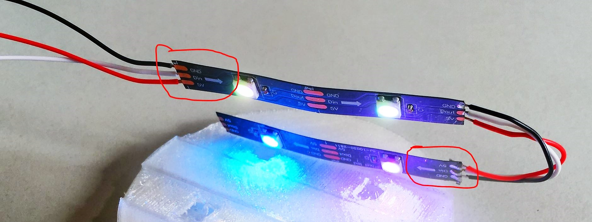
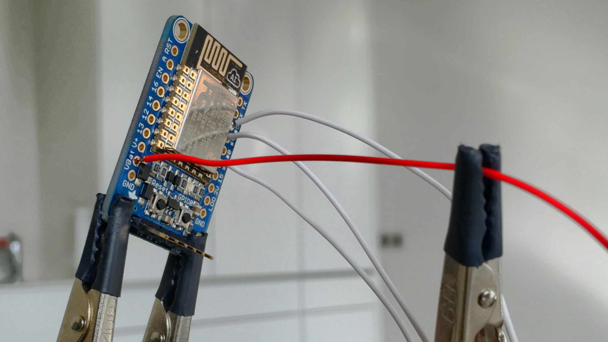

#instructions to build the Dynatrace UFO

##Print the 7 pieces in 5 batches

1. UFO case base + microcontroller holder, plus microcontroller clip
black filament
2. UFO case top + cable stabilizer + mini-switch-clip
black filament
3. separator ring
black filament
4. Downlight inlay + first ring
transparent filament
5. Second ring

##Prepare USB cable
Chop off one end of the USB cable and use the 5V line (red) and ground (black) wire for powering the LED strips as well as the Huzzah ESP8266 microcontroller. Make sure to isolate the other wires so to make sure we wont damage USB source or get in contact with the other electronics.

##Prepare LED strips
Cut the LED strip in pieces of 2 strips with 15 LEDs each and 2 strips with 2 LEDs each. Please make sure you cut exactly in the middle of the soldering tabs, because you will need to solder cables later there. Check out the cutting mark.

##Solder short strips
Solder the short strips in a series accordingly to the data-flow direction. There are arrows on the strip that show you the direction. Data for controlling the bus of LEDs flows from the microcontroller outbound in direction of arrow.

!(2x2 LEDs in series on logo.jpg)

##Wiring
USB cables 5V power goes to "VBat" and the black ground cable goes to "GND"

