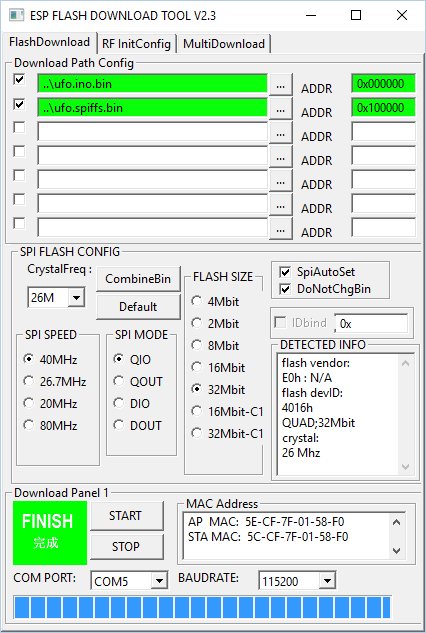
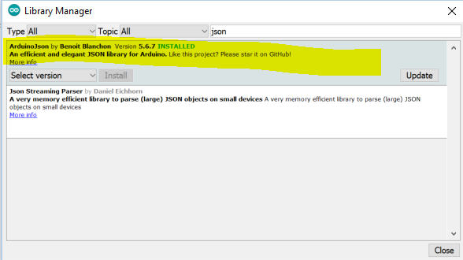

# Instructions for building the Dynatrace UFO

see also [partlist](../partlist)

## Print the 10 pieces in 5 batches

#### We printed using with following settings:
* No supports
* 3 shells
* 0.2 mm layer height (0.1 mm layer worked well too)
* 20% infill

#### 1. UFO case base + microcontroller holder, plus microcontroller clip

black filament

#### 2. UFO case top + cable stabilizer + mini-switch-clip

black filament

#### 3. Separator ring

black filament

#### 4. Downlight inlay + first ring

transparent filament

#### 5. Second ring

transparent filament

##  How it all fits together

## Prepare USB cable
Cut off one end of the USB cable and use the 5V line (red) and ground (black) wire for powering the LED strips as well as the Huzzah ESP8266 microcontroller. Make sure to isolate the other wires to make sure you don't damage the USB source or get in contact with the other electronics.

## Prepare LED strips
Cut the LED strip into 2 strips of 15 LEDs each and 2 strips of 2 LEDs each. Be sure to cut exactly in the middle of the soldering tabs because you will need to solder cables together here later. 

## Solder short strips
Solder the short strips in a series accordingly to the data-flow direction. There are arrows on the strip that show you the direction. Data for controlling the bus of LEDs flows from the microcontroller outbound in direction of arrow.
(Note: image still shows 3-pin led strip, but we switched to 4-pin DotStar LED strips)

The DotStar LED strips use 4 wires

## Wiring

USB cables 5V power goes to "VBat" and the black ground cable goes to "GND"

The white data wires that control the LEDs are soldered as follows:
* Pin 4 - Lower LED ring
* Pin 5 - Upper LED ring
* Pin 2 - Downlight LEDs

The yellow cable is the clock signal for the LED strips
* Pin 14 - DotStar LED clock - connects to all three LED strips

The blue wifi reset cables:
* Pin 15 - Mini-button-switch for wifi reset, to switch the UFO into Access Point mode; triggers when 3V are on pin 15
* Pin 3V (next to pin 15) - Goes to the other contact of the mini-button-switch. 

 
Note that the LEDs need to be powered directly from the USB cable, and not from the 3V pin. So all the red 5V cables and separately all the black ground cables must be soldered together.

## Putting it all together
The Huzzah ESP8266 microcontroller is mounted on top of the downlight inlay and also keeps the 2 short LED strips in their position. For proper isolation, put the printed platform with the 4 pins upside under the Huzzah board and then put all of it inside the clip that holds everything in place.

## Firmware
The initial firmware needs to be programmed using the Serial-USB (FTDI) cable. 
You might need to install a driver on your PC for that cable.
Once you have that completed, you can use the UFO web UI to upload the firmware. 

### Upload firmware available on github
1. Connect the ESP8266 to the FTDI cable and via USB to your computer
1. Place the ESP8266 in firmware programming mode by pressing the buttons in the following sequence:
 * Press and hold Reset 
 * Press GPIO0. You should see the red LED turn on
 * Release reset 
 * Release GPIO0 and make sure the red LED is still lit, as it's signaling that the ESP8266 expects a firmware download

1. Run the `ESP_DOWNLOAD_TOOL_V2.4.exe` from the `firmware/flashtool` folder, configure the proper COM port that's assigned to the FTDI cable and program the ESP8266.

### Build the firmware yourself
1. Install Arduino IDE 1.6.7+ and in the Preferences dialog, type this board manager URL: `http://arduino.esp8266.com/stable/package_esp8266com_index.json`
 Make sure to restart the IDE afterwards.
1. Install the ESP8266 board using Arduino IDE Board Manager under the Tools menu.

1. Configure the microcontroller in IDE 
 * Adafruit Huzzah ESP8266 board
 * 3MB SPIFFS 
 * serial port that's connected to the FTDI serial cable
 * USBtinyISP as Programmer
 * 115200bps 

1. Add *Adafruit DotStar* library, needed to control the LED strips

1. Arduino JSON library

1. Use *Tools->Serial Monitor* to see the output of the ESP8266

1. Place the ESP8266 in firmware programming mode by pressing the buttons in the following sequence:
 * Press and hold Reset
 * Press GPIO0. You should see the red LED turn on
 * Release Reset 
 * Release GPIO0 and make sure the red LED is still lit, as it's signaling that the ESP8266 expects a firmware download
1. Menu *Sketch->Upload CTRL-U* will compile and upload the sketch (firmware) via the serial interface. 
Read more here: [compile and upload firmware through serial](https://learn.adafruit.com/adafruit-huzzah-esp8266-breakout/using-arduino-ide)
1. Upload the Website files to the SPIFFS filesystem. There are two variants to do this:
 * Option 1: Put the ESP8266 into programming mode again and upload the entire content set of the data folder through an Arduino IDE plug-in via the serial interface. 
 Note that the serial monitor must be closed when using the *ESP8266 Sketch Data Upload* function from the Adruino IDE tools menu. 
 Also you do need an Arduino IDE plug-in from here: 
[upload file system and web site](https://github.com/esp8266/Arduino/blob/master/doc/filesystem.md#uploading-files-to-file-system) (SPIFFS)

 * Option 2 (requireds option 1 executed once to format the file system): 
 (TODO: Format the ESP8266 filesystem using the WebUI or api call `/api?formatfilesystem=true`)
 and upload the all files (*.html, *.css, font.*, ...) that are contained in the `data` folder through the Web UI using the firmware upload form. 
 those files will be automatically put on the ESP8266 file system.

 Note: if you want to modify the contents of the webpage, you need to regenerate WebContent.h using Convert_bin2c.py .
 For that to run you need to have Python 2.7+ installed.

## Configure the UFO
Check out the [__Quickstart guide__](../quickstart/readme.md) to configure the UFO.

