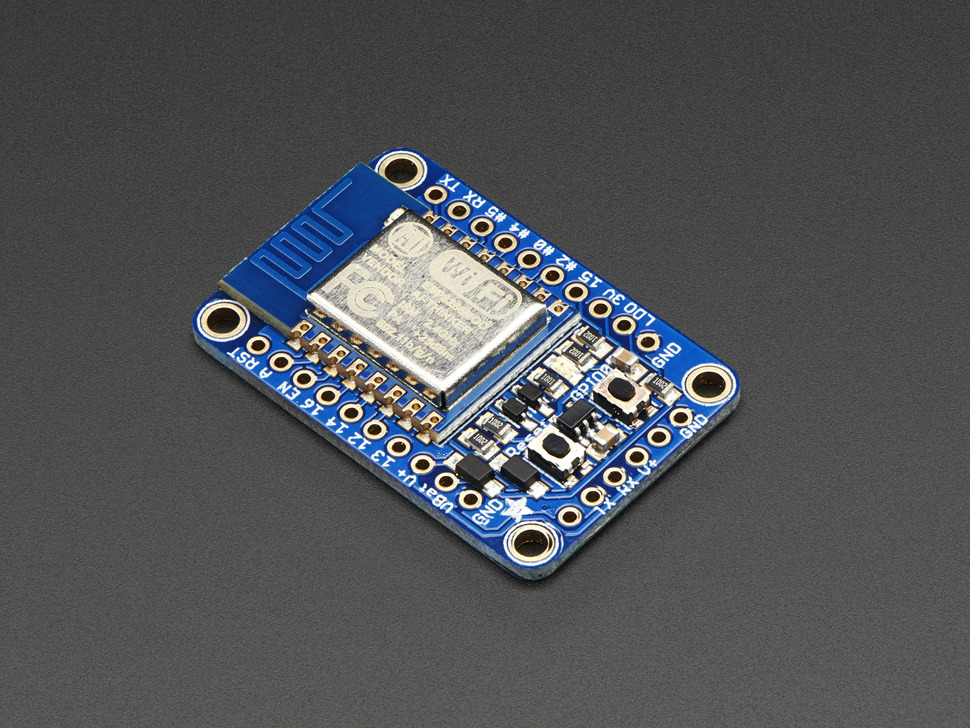
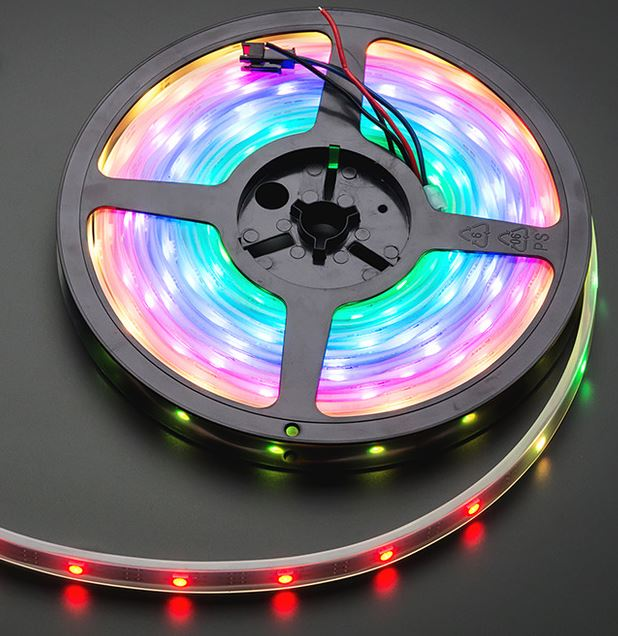
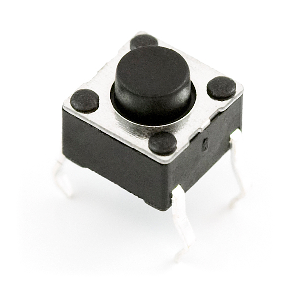
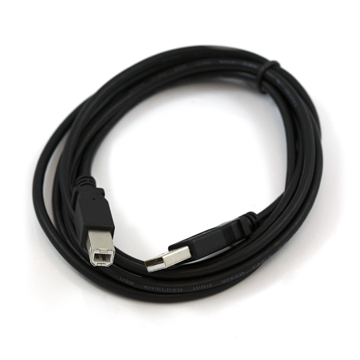

#UFO partlist

##Approximate cost per UFO
* $5 filament (filament spools cost $20 to $65, and you need two colors)
 * black PLA filament
 * transparent PLA filament
* $35 for microcontroller, USB cable, switch and wires
* $10 for 2000mA USB charging device to power the UFO

##What you'll need
* 3D printer capable of printing volume L19cm x W19cm x H12cm minimum
* soldering iron, wires
* FTDI cable (approx $15) for programming the ESP8266

##Places to look for the electronics
* U.S.: Adafruit <http://www.adafruit.com>
* U.S./Internationally: Mouser electronics <http://mouser.com> (they have many international sites such as mouser.de, mouser.at, ...)
* Germany/Austria: Flikto <http://flikto.de> 

##Electronics partlist
* 1x [Adafruit Huzzah ESP8266 breakoutboard](https://www.adafruit.com/products/2471) 

* 2x meters [Adafruit Neopixel RGB LED Strip 800MHz, 30 LED per meter] (https://www.adafruit.com/product/1460)

* 1x [mini-push-button-switch 6x6mm] (https://www.sparkfun.com/products/97)   
 
* 1x [USB cable to power the ufo] e.g. (https://www.sparkfun.com/products/512) but note, the cable must be able to handle the current of up to 2A; and we will clip off one of the plugs 

* If you don't have it yet, you will need this cable for programming [Sparkfun FTDI 5V with 3.3V IO cable] (https://www.sparkfun.com/products/9717) 

