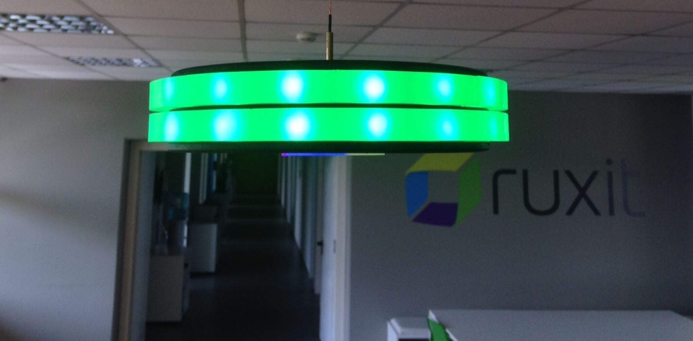

#The UFO Story

*Bernd:* Hi Helmut, you have invented the UFO - a multidimensional state visualization device -  for Dynatrace to improve our agile development, build and continuous delivery processes. 
So what exactly is the UFO and what motivated you to create it?

__Helmut:__ I created the UFO because we had a lack of awareness of build problems in our CI process. 
It very often happened that developers broke the pipeline but have not been aware of the fact that there are any problems at all 
and therefore did not start to think if their changes might be the cause. 
Installing this visualization device in our cafeteria made a big change in the actual 
awareness of our developers regarding build failures but also in their mindset 
that those conditions need to be avoided at any cost – you don’t want to be the one which flooded the cafeteria with red light.

So generally stated, the UFO is a general state visualization device. The requirement to function from any view angle gave it it’s UFO like appearance. It consists of 2 layers which basically emit light in arbitrary color and animation. However, for us, its real-time feedback on our build and continue delivery process to keep the team in-sync and responsible.

*Bernd:* how did it change behavior of the team?

__Helmut__: The team has become more sensitive on checking in before going home. When the UFO goes red in the cafeteria, the ones who checked in definitly double check the build results and their inbox where their bugs get routet to.

*Bernd:* As our team is has hundreds of engineers, one can impact many, right? 

__Helmut:__ Build failures and consequently the red state of the build pipeline not only blocks all developers from committing their changes but also delays the build entering of the various automated test-stages which basically just slows down the overall development process and diminishes our productivity.

A fast pipeline is especially crucial in our devops environment as we require to bring potential fixes into production as fast as possible. The optimal utilization of our automated test-resources is an important factor for us, as well.

*Bernd:* The UFO is with its more 34 individual controllable RGB LEDs more powerful than a classic "red alert" lamp. So how is it integrated with the continuous delivery process?

__Helmut:__ The UFO is directly fed with the pipeline state by our quickbuild server at the end of every run via a simple rest interface. One layer of the UFO is visualizing the trunk pipeline whereas the other one is showing our sprint pipeline state. The DevOps team controls the UFO using Dynatrace Application Monitoring / UEM and Ruxit interfaces. But of course, you can control it from any software capable of performing REST calls.

*Bernd:* We had several top customers who came into our office ask for such an UFO. Since you have built it yourself, what can we tell customers who want that too? Here are pictures of the original so everyone can see what I am talking about:
 

__Helmut:__ Oh, yes. The original version used Raspberry PI and multiple PIC microcontrollers I used in plenty of my other projects. To reduce the total number of parts, we have designed an open-source version of that UFO that is easily printable on a standard 3D printer and a single ESP8266 WiFi microcontroller. The total cost is in the range of $80 including the WiFi enabled electronics. Its available at https://github.com/Dynatrace/Dynatrace-UFO
